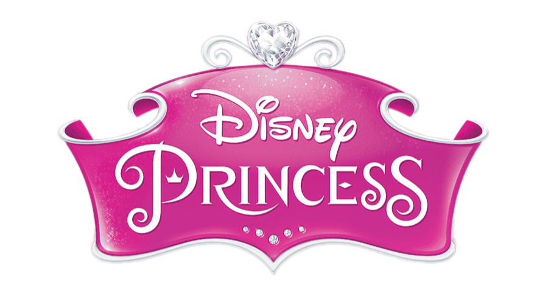

# Nguyen_Linh_HW2_Character_Build

## HW2 - Character Build (CSS Selection and Styles)

### Disney Princesses Build For Fall 2024
*Discover Your Princesses!*

"Once upon a time, in realms shimmering with magic and dreams, there existed princesses who taught us the true meaning of courage, kindness, and love. Each princess, born of royal blood or a humble heart, faced trials and adventures that shaped her destiny. From towers reaching the heavens to castles hidden in enchanted forests, they embarked on journeys filled with wonder and wisdom. With bravery that conquers darkness and hearts that radiate light, they invite you to step into their stories. As you explore this realm, hover over or click on each princess to reveal the tales woven with magic, friendship, and the pursuit of dreams. Discover the strength, beauty, and grace that make each princess a beloved legend. So take a step into the world of wonder—your 'happily ever after' awaits!"

Hover over or click on each princess to learn more about their magical stories!

---

## Character Descriptions

### Rapunzel - The Lost Princess of the Tower

Rapunzel is a symbol of curiosity and resilience, living isolated in a tower with her magical, healing hair and unaware of her royal origins. Despite her confinement, she fills her days with art, music, and dreams of adventure. Her imagination and optimism fuel her spirit, keeping her resilient against loneliness. When Rapunzel meets Flynn Rider, she bravely seizes the chance to leave her tower and chase her dreams. Her journey teaches the value of courage, self-discovery, and following one’s dreams despite obstacles.

---

### Snow White - The Fairest of Them All

Snow White, the first Disney Princess, embodies innocence and kindness, even when faced with jealousy and danger from her wicked stepmother, the Evil Queen. Forced to flee into the forest, she finds a new life with the Seven Dwarfs, who cherish her gentle spirit and pure heart. Despite the Queen’s cruel spell, Snow White’s goodness ultimately triumphs when true love’s kiss awakens her.

---

### Ariel - The Little Mermaid

Ariel is a daring mermaid princess with an intense curiosity for the human world. Fascinated by life on land, she collects treasures and dreams of being part of that world, despite her father King Triton’s warnings. To be with Prince Eric, Ariel trades her voice to the sea witch Ursula for human legs, embarking on a risky journey on land.

---

### Belle - Beauty and the Beast

Belle, a book-loving and kind-hearted young woman, longs for adventure beyond her village. When she takes her father’s place as a prisoner in the Beast’s castle, she discovers the beauty within him. Their growing bond ultimately breaks the curse on the Beast and his castle.

---

### Aurora - Sleeping Beauty

Aurora, blessed with beauty and grace, lives under the shadow of a curse cast by the wicked fairy Maleficent. Hidden in a forest by the good fairies to protect her, Aurora grows up dreaming of love and a brighter future. When the curse takes effect, Aurora’s life is saved by true love’s kiss, celebrating destiny and the triumph of good over evil.

---

### Cinderella - The Glass Slipper Princess

Cinderella is a beacon of kindness and resilience, enduring mistreatment from her stepmother and stepsisters. Her hope leads her to a magical night at the royal ball, where she captures the prince’s heart. Despite her hardships, Cinderella’s story shows that kindness and perseverance can open doors to happiness.

---

### Conclusion
In this project, I celebrate the timeless stories of Disney princesses, showcasing their journeys of courage, love, and self-discovery. Hover over or click on each princess image to delve deeper into their magical worlds!
